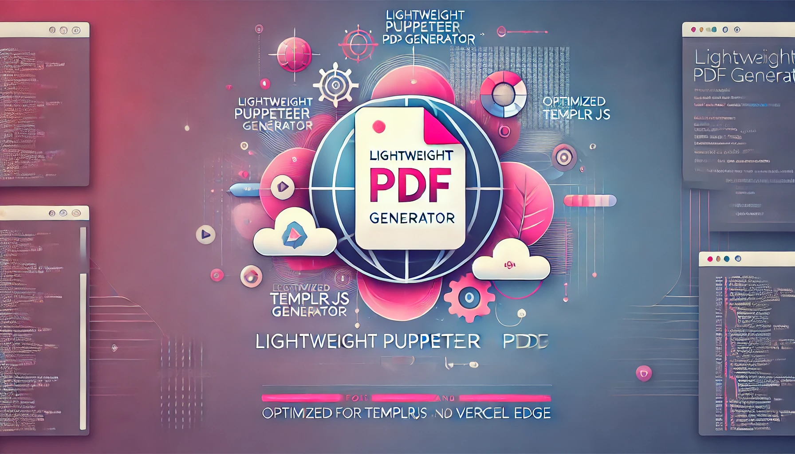

# web2pdf



This microservice supports simple PDF export needs in the **[TemplrJS Nuxt Fullstack Framework](https://github.com/senthilsweb/templrjs.git)**, such as generating blog articles, profile cards, and other lightweight use cases. It avoids the overhead of heavy PDF reporting tools, focusing on efficiency and compatibility with edge platforms like Vercel.


## **Motivation**
- **Edge-Optimized**: Runs seamlessly on serverless platforms like Vercel.
- **Lightweight Design**: Ideal for straightforward requirements like exporting blog articles or profile cards.
- **Cost-Effective**: Tailored for small-scale use cases without relying on resource-heavy reporting tools.
- **Integration-Ready**: Easily integrates with [TemplrJS](https://github.com/senthilsweb/templrjs.git) and other frameworks for rapid deployment.

## **Getting Started**
### **Setup**

Clone the repository and navigate to the project directory:

```bash
git clone https://github.com/senthilsweb/web2pdf.git
cd web-to-pdf
```

Install dependencies for production:

```bash
npm install puppeteer-core @sparticuz/chromium
```

### **Local Development**

For local testing, install the full Puppeteer package to use its bundled Chromium binary:

```bash
npm install puppeteer
npm run dev
```

Ensure the code dynamically switches between `puppeteer` (for local testing) and `puppeteer-core` with `@sparticuz/chromium` (for production).

### **Deploy to Vercel**

This project is set up with **Vercel GitHub integration** for automatic deployment. Simply push changes to your GitHub repository, and Vercel will build and deploy the application automatically.

For manual deployment or debugging, you can use the Vercel CLI:

1. Install the Vercel CLI:
   ```bash
   npm install -g vercel
   ```

2. Deploy the project manually:
   ```bash
   vercel --prod
   ```

3. In the Vercel Dashboard, navigate to **Settings > Functions** and increase the memory allocation for the serverless function to `1024 MB` or higher.


## **API Endpoints**
### **Generate PDF**
**Route**: `/api/pdf`

| Parameter       | Description                                        |
|-----------------|----------------------------------------------------|
| `url` (required)| The URL of the page to convert to PDF.             |
| `header`        | Optional header text.                              |
| `footer`        | Optional footer text.                              |
| `pageNumbers`   | Adds page numbers if set to `true`.                |

### **Examples**
1. Simple PDF:
   ```
   GET /api/pdf?url=https://example.com
   ```
2. PDF with header, footer, and page numbers:
   ```
   GET /api/pdf?url=https://example.com&header=My+Header&footer=My+Footer&pageNumbers=true
   ```

### **Demo**

Try the API with the following example:

**Example: 1**
```plaintext
https://export2pdf.vercel.app/api/pdf?url=https://www.senthilsweb.com/cms/senthilnathan-karuppaiah?print=true&pageNumbers=true
```
**Example: 2**
```
https://export2pdf.vercel.app/api/pdf?url=https://www.senthilsweb.com/blog/using-makefiles-to-bundle-a-full-stack-app-into-a-go-binary?print=true&pageNumbers=true
```

> **Note**: If you encounter a function timeout error, simply refresh the page or retry the API call.

## **Features**
- **Dynamic Customization**: Add headers, footers, and page numbers on the fly.
- **Edge-Compatible**: Optimized for serverless environments like Vercel.
- **Lightweight Performance**: Minimal resource usage for cost-effective deployments.

## **Limitations**
- **Memory Requirements**: Puppeteer can be resource-intensive; allocate sufficient memory for larger PDFs.
- **Cold Starts**: Slight delays may occur for infrequently used endpoints.


### **Acknowledgment**

This implementation leverages insights from the article ["Use Puppeteer on AWS Lambdas"](https://www.thebiltheory.com/blog/use-puppeteer-on-aws-lambdas) by **The Bilt Theory**, which provides excellent guidance on optimizing Puppeteer for serverless environments. Many thanks to the author for the detailed explanations and strategies!